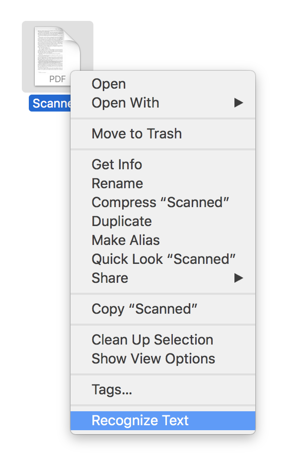
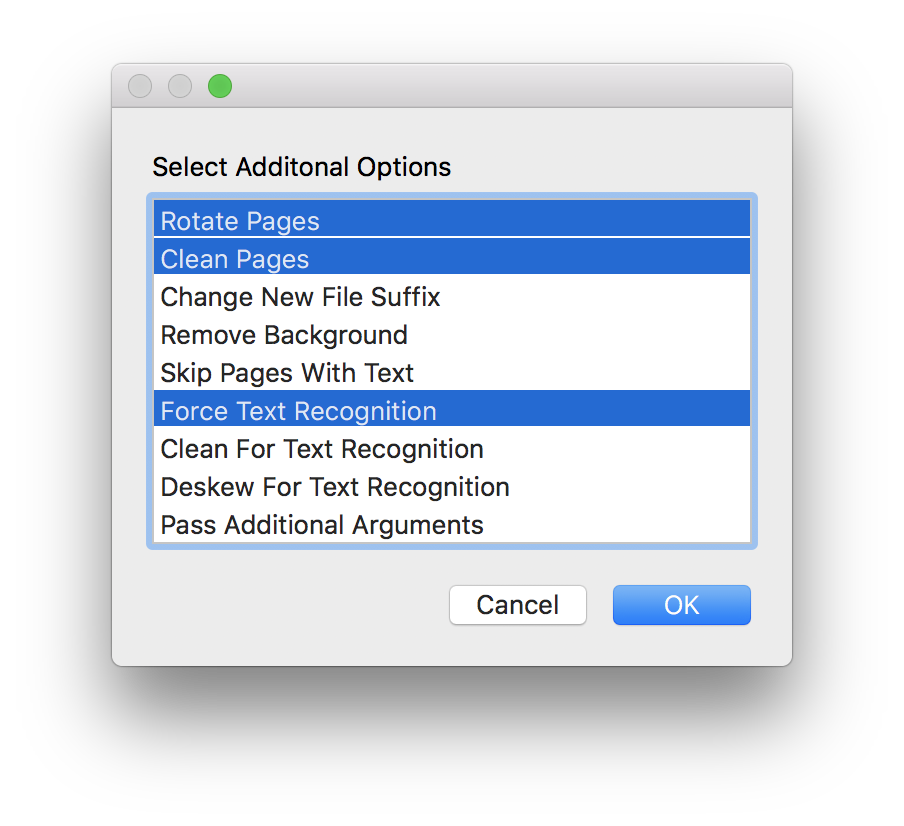

A macOS service for processing PDF files with [OCRmyPDF](https://github.com/jbarlow83/OCRmyPDF).

# Installation

1. Install OCRmyPDF by running `brew install ocrmypdf`.
2. Download this repository.
3. Open `Recognize Text.workflow` and press "Install" when prompted.

# Usage

In Finder, select a PDF file (or multiple PDF files) and select "Recognize Text" from the contextual menu.

Optionally, before pressing "Begin," press "Options" to use additional features supported by OCRmyPDF.

<small>Note: I quickly put together this service because I wanted a quicker way to run OCRmyPDF; at this point, it likely contains bugs. Please report any bugs you encounter while using it.</small>
